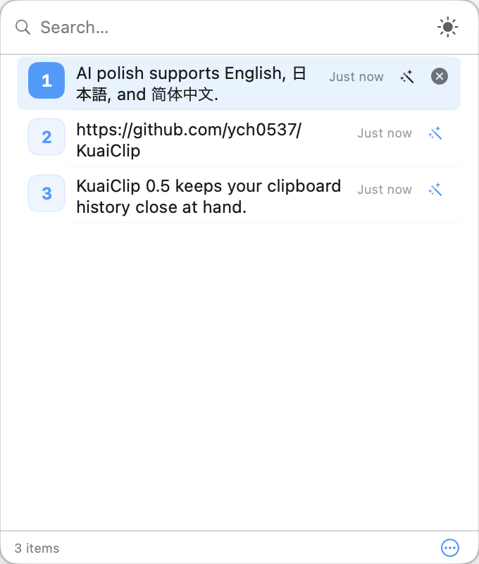
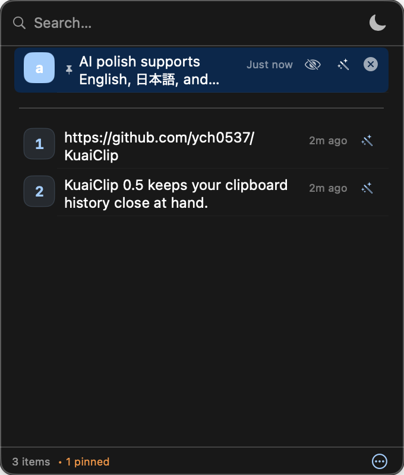
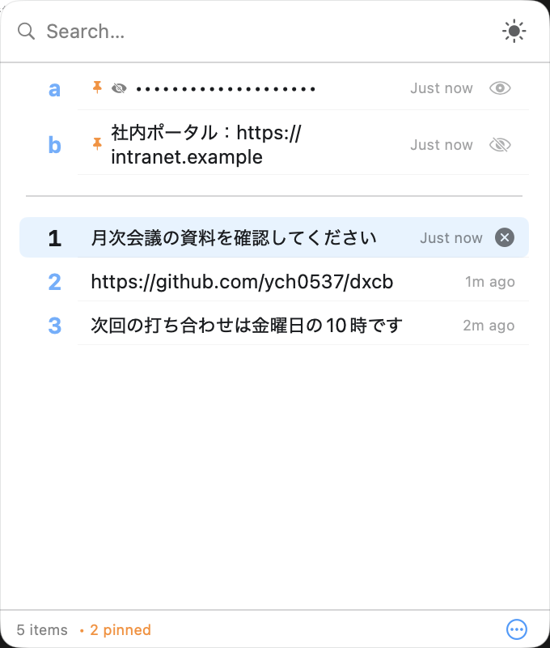
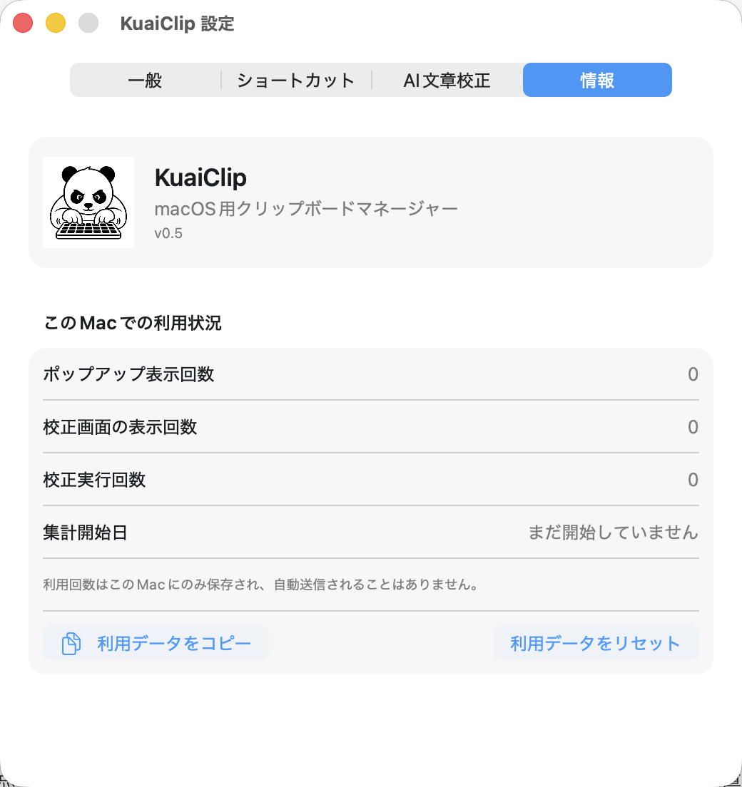

# KuaiClip

<p align="center">
  
</p>

<p align="center">
  <strong>A lightweight, native macOS clipboard manager that lives in your menu bar.</strong><br>
  <sub>SwiftUI + AppKit • macOS 14+ • No Electron, no bloat</sub>
</p>

<p align="center">
  <a href="https://github.com/ych0537/KuaiClip/releases/latest"></a>
  <a href="LICENSE"></a>
  
  
</p>

---

<p align="center">
  <a href="Readme.md">English</a> · <strong>日本語</strong> · <a href="Readme.zh-CN.md">简体中文</a>
</p>

---

### 概要

**KuaiClip** は、SwiftUI と AppKit で構築された軽量でネイティブな macOS 用クリップボードマネージャーです。メニューバーに常駐し、クリップボード履歴の検索・コピー・貼り付け・ピン留め・管理をすべてキーボードから行えます。

- **対応 OS**: macOS 14 Sonoma 以降
- **アーキテクチャ**: SwiftUI + AppKit（`NSStatusBar`、`NSPanel`、Carbon `HotKey`、`CGEvent`）
- **保存方式**: `UserDefaults`（再起動後も保持）
- **Electron 不使用**: ネイティブパフォーマンス、最小限のリソース消費

### 機能

- 🔍 **インスタント検索** — 入力するだけで履歴を絞り込み
- 📌 **ピン留め** — パスワードや定型文などを常に利用可能に
- 👁 **センシティブな内容の非表示** — ピン留めした項目の目アイコンで表示/非表示を切替。非表示にした内容は使用後も履歴に再追加されません
- 🎨 **Codex Desktop準拠の2テーマ** — ライト / ダーク、ポップアップから切替可能
- 🖱 **マウスホバー選択** — マウスを動かすだけで項目を即座に選択
- ⌨️ **完全キーボード操作** — すべての操作にショートカットあり
- 📋 **リッチフォーマット検出** — テキスト、RTF、HTML、URL、ファイルパス、画像
- 🔄 **最近使用した順に整列** — 同一内容と使用済みの未固定項目は先頭に移動
- ⚡ **ダイレクトペースト** — コピー＋貼り付けをワンアクションで
- 🚀 **ログイン時起動** — 設定からオン/オフ可能
- 🌐 **多言語対応** — English / 日本語 / 简体中文
- ↔️ **ポップアップサイズ記憶** — 調整した幅と高さを次回表示時に復元
- ✨ **AIビジネス文章校正** — OpenAI、Gemini、DeepSeekで中国語・英語・日本語のメール文章を自然に校正
- 🖼 **統一サイズの画像サムネイル** — コピーした画像を履歴内で同じサイズに揃えて表示
- 🐼 **選べるアプリアイコン** — アプリとメニューバーのアイコンを6種類のモノクロマスコットから選択
- 📊 **ローカル利用回数** — Popup表示、校正画面表示、校正実行をこのMacだけで集計。自動送信せず、任意アンケート用に明示的にコピー可能
- 📸 **スクリーンショットと注釈** — 範囲・ウィンドウ・全画面を撮影し、図形、矢印、手描き、モザイク、テキスト、番号を追加

### かんたん操作マニュアル

KuaiClipは、Macでコピーした内容を履歴として覚えるアプリです。元の資料やWebページへ戻らなくても、Popupから以前のコピー内容を選んで再利用できます。

#### 1. 基本操作：開く → 選ぶ → 貼り付ける

1. テキストやURLなどを普段どおりコピーします。コピーするたびに履歴へ追加されます。
2. **左⌘をダブルタップ**、または代替ショートカット **⇧⌘C** でPopupを開きます。
3. `↑` / `↓` キー、またはマウスで使いたい項目を選びます。
4. `Enter`でコピーし、貼り付け先で`⌘V`を押します。直前のアプリへすぐ貼り付ける場合は`⌥Enter`を使います。



#### 2. 固定（Pinned）：よく使う内容を残す

1. 定型挨拶、社内URL、テンプレート名など、繰り返し使う項目を選びます。
2. `⌥P`を押すか、右クリックメニューから**固定**を選びます。
3. 固定項目は常に上部へ表示され、通常履歴とは別に`a`～`j`で採番されます。Popup表示中は`⌘A`～`⌘J`で直接コピーできます。
4. 固定できるのは最大10件です。11件目を追加する場合は、不要な固定項目を先に解除します。



#### 3. 非表示：機密文字列を画面上で隠す

1. 対象項目を先に固定します。
2. 右側の斜線付き目アイコンをクリックするか、右クリックメニューから**内容を隠す**を選びます。
3. 内容が点（••••）に置き換わります。再表示するときは目アイコンをクリックします。
4. 非表示項目を`⌥Enter`で直接貼り付けると、使用後に履歴から削除されます。



> 非表示は、Popupを見られたときの覗き見を防ぐための表示上のマスキングであり、暗号化ではありません。履歴はmacOSの`UserDefaults`へローカル保存されるため、機密情報が不要になったら消去機能を利用してください。

#### 4. AI文章校正：ビジネスメールを自然に整える

1. `⌘,`で設定を開き、**AI文章校正**からOpenAI、Gemini、DeepSeekのいずれかのAPIキーを入力します。キーはmacOSキーチェーンに保存されます。
2. クリップボードのPopupを開き、テキスト項目の右側にある魔法の杖ボタンをクリックします。画像と非表示項目には表示されません。
3. APIキーを設定済みのモデルを選び、送信ボタンをクリックします。
4. 中国語・英語・日本語を自動判定し、元の言語と意味を維持したまま、自然で丁寧なビジネス文章へ校正します。
5. 結果はコピーボタンからコピーできます。AI校正は1回につき最大**20,000文字**です。通常のクリップボード履歴にはこの制限はありません。

> AI校正では、選択した文章が指定したAIプロバイダーへ送信され、プロバイダー側のAPI料金が発生する場合があります。KuaiClipが自動的にクリップボード内容を送信することはありません。

#### 5. スクリーンショット：撮影・注釈・保存・コピー

1. 初期設定のスクリーンショットショートカット **⇧⌘S** を押します。クリップボードPopupのショートカットとの重複は自動で検出されます。
2. **範囲**、**ウィンドウ**、**全画面**から撮影方法を選びます。
3. 四角形、楕円、直線、矢印、ペン、モザイク、テキスト、番号で注釈を追加できます。取り消しと全消去にも対応します。
4. **ダウンロード**を押すと、クリップボードや履歴を変更せずPNGを`~/Downloads`へ保存します。
5. **コピー**を押すと、PNGをシステムクリップボードへ書き込み、KuaiClipの履歴にも追加します。

ショートカットは**設定 → ショートカット**で変更できます。初回撮影時にはmacOSの**画面収録**権限が必要です。

### インストール

#### ダウンロード（推奨）

[GitHub Releases](https://github.com/ych0537/KuaiClip/releases/latest) から `KuaiClip.app.zip` をダウンロードして展開し、`KuaiClip.app` を `/Applications/` へ移動して起動してください。

公式Releaseは **Developer ID署名**、Apple notarization、チケットのstapleを完了しています。通常はquarantine属性の手動削除やGatekeeperの無効化は不要です。KuaiClipはメニューバーにのみ表示され、Dockアイコンは表示しません。

#### ソースからビルド

```bash
git clone https://github.com/ych0537/KuaiClip.git
cd KuaiClip
swift build -c release
BUILD_DIR=.build/release bash scripts/package.sh
open KuaiClip.app
```

### 使い方

#### ポップアップウィンドウ

| 操作 | ショートカット |
|------|----------------|
| ポップアップ表示 / 非表示 | **左⌘ダブルタップ**（初期設定）または **⇧⌘C**（フォールバック） |
| ポップアップを閉じる | `Esc` またはポップアップ外をクリック |

> **注意**: ダブルタップには **アクセシビリティ** 権限が必要です。権限がない場合、自動的に ⇧⌘C にフォールバックします。

#### ポップアップ内の操作

| 操作 | ショートカット / 操作 |
|------|----------------------|
| 検索 / フィルタ | 検索フィールドに入力 |
| リスト移動 | `↑` / `↓` 矢印キー |
| 項目を選択 | マウスホバー |
| 選択項目をコピー | `↩` Enter / クリック / `⌘1-9`（未固定）/ `⌘A-J`（固定） |
| コピーして直接貼り付け | `⌥↩` / ⌥クリック / `⌥1-9`（未固定）/ `⌥A-J`（固定） |
| 書式なしで貼り付け | `⌥⇧↩` / ⌥⇧クリック / `⌥⇧1-9`（未固定）/ `⌥⇧A-J`（固定） |
| 選択項目を削除 | `⌥⌫` |
| ピン留め / 解除 | `⌥P` |
| 表示/非表示切替（ピン留め項目） | 👁 ボタンをクリック |
| ピン留め以外を全削除 | `⌥⌘⌫` |
| すべて削除（ピン含む） | `⌥⇧⌘⌫` |
| 全文プレビュー | 項目にホバー（約1秒） |
| 設定を開く | `⌘,` |

#### メニューバーアイコン

| 操作 | 方法 |
|------|------|
| ポップアップ表示 | アイコンを左クリック |
| 監視の無効化 / 再有効化 | `⌥` + 左クリック |
| 次のコピーのみ無視 | `⌥⇧` + 左クリック |
| 右クリックメニュー | 設定 / 終了 |
| 監視無効時の表示 | アイコンが薄くなる（不透明度 40%） |

#### 設定（`⌘,`）

| セクション | 項目 |
|------------|------|
| **一般** | 最大履歴数（10～100）、ポーリング間隔（0.25～2.0秒）、ログイン時起動、デフォルトで書式なし貼り付け、言語（English / 日本語 / 简体中文） |
| **ショートカット** | Popup起動方法、スクリーンショット用ショートカット、重複チェック、Popup内ショートカット一覧 |
| **AI文章校正** | macOSキーチェーンに保存するOpenAI、Gemini、DeepSeekのAPIキー |
| **情報** | アプリアイコン、バージョン、ローカル利用回数、アンケート用コピー、リセット |



利用回数はこのMacの`UserDefaults`だけに保存され、自動送信されません。アンケートへ共有する場合も、利用者が明示的に「利用データをコピー」を押します。

### テーマ

ポップアップの検索バーにあるテーマボタン（☀/🌙）をクリックすると、2つの外観モードを切り替えられます。どちらもCodex Desktopと同じメイン背景色・前景色・ネイティブフォント構成です：

| モード | アイコン | 説明 |
|------|------|------|
| **ライト** | ☀ | 背景 `#FFFFFF`、前景 `#1A1C1F`、system UIフォント、SF Monoコードフォント |
| **ダーク** | 🌙 | 背景 `#181818`、前景 `#FFFFFF`、system UIフォント、SF Monoコードフォント |

既存の「システム」はライトへ、「グレー」はダークへ自動移行します。

### クリップボード監視

- `NSPasteboard.general` を設定可能な間隔（0.25～2.0秒）でポーリング
- テキスト、RTF、HTML、URL、ファイルパス、画像を検出
- 最近使用した順に整列 — 同一内容と使用済みの未固定項目は先頭に移動
- 非テキスト項目はタイプバッジで表示：🖼 画像、📁 ファイル、📦 その他

### 履歴管理

- **ピン留め**: 最大10件、`a～j` で採番します。11件目を固定しようとするとアラートを表示します。
- **最大履歴数**: 未固定項目は10～100件（デフォルト50）で、固定項目とは別に `1` から採番します。超過分は古い順に自動削除します。
- **非表示コンテンツ**: ピン留め項目の内容を非表示にできます（👁）。非表示項目を使用すると、その内容はクリップボード履歴に再追加されません — パスワードや機密情報に最適です。
- UserDefaults により再起動後も保持。

### セキュリティと権限

| 機能 | 必要な権限 | 理由 |
|------|-----------|------|
| クリップボードの読み書き | 不要 | 標準 `NSPasteboard` API |
| 左⌘ダブルタップ | **アクセシビリティ** | `NSEvent.addGlobalMonitorForEvents` |
| 貼り付けシミュレーション（`⌥↩`） | **アクセシビリティ** | `CGEvent` を `kCGHIDEventTap` に送信 |
| カスタム Carbon ホットキー | 不要 | Carbon `RegisterEventHotKey` API |

**アクセシビリティ権限の付与手順:**
1. **システム設定 → プライバシーとセキュリティ → アクセシビリティ** を開く
2. **＋** ボタンをクリックして `KuaiClip.app` を追加
3. スイッチをオンにする

> アクセシビリティ権限がない場合、KuaiClip は自動的に `⇧⌘C` をポップアップショートカットとして使用します。貼り付けシミュレーション（`⌥↩`）にはアクセシビリティが必要です。権限がない場合は `↩`（コピーのみ）＋手動 `⌘V` を使用してください。

### プライバシー

- **履歴はローカル保存**: クリップボード履歴はデバイス上の `UserDefaults` に保存されます。
- **明示操作時のみAI通信**: AI校正ボタンを押した場合のみ、選択した文章をOpenAI、Gemini、DeepSeekの指定プロバイダーへ送信します。
- **キーチェーン保護**: AIのAPIキーは`UserDefaults`ではなくmacOSキーチェーンに保存します。
- **解析・テレメトリーの自動送信なし**: Popup表示回数とAI校正利用回数はこのMacだけに保存され、利用者が任意アンケートへ明示的にコピーした場合のみ共有されます。クリップボード内容は統計に含めません。
- **クリップボード内容の個別ファイル保存なし**: クリップボード内容は個別ファイルとして保存されず、永続化される履歴はアプリの設定 plist に保存されます。
- **非表示コンテンツの保護**: 非表示設定されたピン留め項目は使用後すぐに履歴から削除され、クリップボードモニターによって再追加されることもありません。

### セキュリティ・権利・配布審査

これはリポジトリレベルの審査結果であり、法的助言ではありません。広く外部配布する前に、ライセンスと署名要件をプロジェクトオーナー側で最終確認してください。

| 項目 | 結果 | メモ |
|------|------|------|
| ローカルデータ処理 | 合格 | クリップボード履歴は `UserDefaults` にローカル保存され、データベースやリモート保存は使っていません。 |
| ネットワークアクセス | ユーザー操作時のみ | 明示的に実行したAI校正だけが通信します。解析・テレメトリー経路はありません。 |
| 権限 | ユーザー許可前提で合格 | アクセシビリティ権限はダブルタップ検出と貼り付けシミュレーションにのみ必要です。フォールバックショートカットは権限なしで動作します。 |
| センシティブなピン留め内容 | 合格 | 非表示のピン留め内容は使用後に履歴から削除され、クリップボード監視でも再追加されません。 |
| 永続化リスク | 要確認 | テキスト履歴やピン留め項目は、削除するまで `~/Library/Preferences/com.kuaiclip.clipboard.plist` に残ります。必要に応じてユーザーが消去してください。 |
| サードパーティ依存 | 合格 | `Package.swift` に外部パッケージ依存はありません。 |
| ライセンス権利 | 合格 | MIT ライセンス本文をリポジトリ直下の `LICENSE` ファイルに含めています。 |
| 配布の信頼性 | 合格 | 公式ReleaseはDeveloper ID署名、Apple notarization、stapleを完了し、`codesign`、`stapler`、Gatekeeper（`spctl`）で検証します。 |

### トラブルシューティング

<details>
<summary><strong>「KuaiClip.appは壊れているため開けません」と表示される</strong></summary>

公式GitHub Releaseからもう一度ダウンロードし、ZIPを完全に展開してから`/Applications`へ移動してください。公式Releaseは公証済みのため、通常のインストールでGatekeeperを無効化したりquarantine属性を削除したりしないでください。警告が続く場合は、ReleaseバージョンとZIPのチェックサムをGitHub Issueへ報告してください。
</details>

<details>
<summary><strong>ダブルタップ⌘が効かない</strong></summary>

ダブルタップにはアクセシビリティ権限が必要です：
1. **システム設定 → プライバシーとセキュリティ → アクセシビリティ**
2. `KuaiClip.app` を追加して有効にする
3. KuaiClip を再起動

または、設定（`⌘,` → ショートカット）でカスタムホットキーに切り替えてください。
</details>

<details>
<summary><strong>⌥↩（直接貼り付け）が効かない</strong></summary>

貼り付けシミュレーションにも **アクセシビリティ** 権限が必要です（上記参照）。権限がない場合は `↩` でコピー後、手動で `⌘V` してください。
</details>

<details>
<summary><strong>アンインストール方法は？</strong></summary>

1. メニューバーアイコンの右クリックメニューから KuaiClip を終了
2. `/Applications` から `KuaiClip.app` を削除
3. （任意）保存データの消去：
   ```bash
   defaults delete com.kuaiclip.clipboard
   ```
</details>

<details>
<summary><strong>テーマ切替ボタンが反応しない</strong></summary>

最新バージョン（v0.5以降）を使用していることを確認してください。それでも問題が発生する場合：
1. KuaiClip を終了して再起動
2. 設定をリセット：`defaults delete com.kuaiclip.clipboard`
</details>

### ソースからビルド

```bash
# クローン
git clone https://github.com/ych0537/KuaiClip.git
cd KuaiClip

# ビルド（デバッグ）
swift build

# テスト
bash scripts/test.sh

# ビルド（リリース）+ .app にパッケージ
swift build -c release
BUILD_DIR=.build/release bash scripts/package.sh

# 実行
open KuaiClip.app
```

**要件**: Xcode 15+（Swift 5.9）、macOS 14+


### データ保存とプライバシー

**データの保存場所**

すべてのクリップボード履歴は macOS の UserDefaults に保存されます：

```
~/Library/Preferences/com.kuaiclip.clipboard.plist
```

**重要な注意点：**

| 項目 | 詳細 |
|------|------|
| **テキスト** | UTF-8 でそのまま保存 |
| **画像** | 元のピクセル寸法を維持したフル解像度PNGとして保存 |
| **最大件数** | 設定可能（10～100、初期値 50）。古いピン留めなし項目は自動削除 |
| **ピン留め** | 最大10件、自動削除されません |

**プライバシー**: 履歴はデバイス上に保存されます。AI校正を明示的に実行した場合のみ、選択した文章が指定プロバイダーへ送信されます。

**データを消去する方法**:
- メニューバーアイコンを右クリック → Clear All Items
- または `defaults delete com.kuaiclip.clipboard` を実行


### 開発・レビュー支援ツール

| 用途 | ツール |
|------|--------|
| Codingツール集 | Ollama + Qwen3.6 + Gemma4 + Codex |
| レビュー・テスト・審査 | Codex + GPT5.5 |

### ライセンス

[MIT](LICENSE)

---
