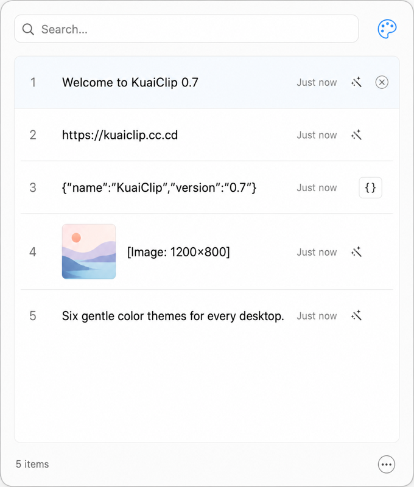
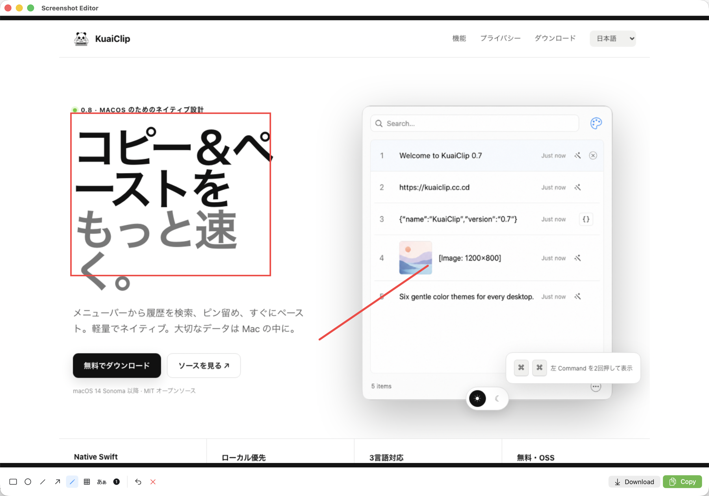

# KuaiClip

<p align="center">
  
</p>

<p align="center">
  <strong>A lightweight, native macOS clipboard manager that lives in your menu bar.</strong><br>
  <sub>SwiftUI + AppKit • macOS 14+ • No Electron, no bloat</sub>
</p>

<p align="center">
  <a href="https://github.com/ych0537/KuaiClip/releases/latest"></a>
  <a href="LICENSE"></a>
  
  
</p>

---

<p align="center">
  <a href="Readme.md">English</a> · <a href="Readme.ja.md">日本語</a> · <strong>简体中文</strong>
</p>

---

### 简介

**KuaiClip** 是一款基于 SwiftUI 与 AppKit 开发的原生 macOS 菜单栏剪贴板管理器，支持搜索、复制、直接粘贴、固定、隐藏、图片预览和 AI 职场文本润色。



- **系统要求**：macOS 14 Sonoma 或更高版本
- **界面语言**：English / 日本語 / 简体中文
- **本地存储**：剪贴板历史和使用次数保存在本机 `UserDefaults`
- **原生实现**：不使用 Electron，无第三方 Swift Package 依赖

### 主要功能

- 即时搜索剪贴板历史，支持键盘与鼠标操作
- 固定最多 10 个常用项目，并使用 `a`–`j` 独立编号
- 隐藏固定项目内容，减少屏幕窥视风险
- 支持文本、RTF、HTML、URL、文件路径和图片
- 支持复制、直接粘贴以及无格式粘贴
- 支持浅色与深色主题、六种 App 与菜单栏图标
- 使用 OpenAI、Gemini 或 DeepSeek 润色中文、英文和日文职场文本
- 在“关于”页面显示本机累计使用次数，便于用户主动填写问卷
- 支持区域、窗口和全屏截图，并可添加矩形、圆形、直线、箭头、画笔、马赛克、文字和编号标注
- 使用 Apple Vision 在本机识别复制图片中的文字，无需上传图片


### 安装

1. 从 [GitHub Releases](https://github.com/ych0537/KuaiClip/releases/latest) 下载 `KuaiClip.app.zip`。
2. 解压后将 `KuaiClip.app` 移动到 `/Applications/`。
3. 启动 KuaiClip；它只显示在菜单栏，不显示 Dock 图标。

官方 Release 已完成 Developer ID 签名、Apple 公证和票据 staple，并经过 Gatekeeper 验证。正常安装不需要关闭 Gatekeeper，也不需要手动删除 quarantine 属性。

### 基本操作

| 操作 | 快捷键或方式 |
|------|--------------|
| 打开或关闭主窗口 | 双击左侧 `⌘`，或备用快捷键 `⇧⌘C` |
| 搜索 | 直接在搜索框输入 |
| 上下选择 | `↑` / `↓` |
| 复制 | `Enter`、点击、`⌘1–9` 或 `⌘A–J` |
| 复制并直接粘贴 | `⌥Enter` |
| 无格式粘贴 | `⌥⇧Enter` |
| 固定或取消固定 | `⌥P` |
| 删除所选项目 | `⌥Delete` |
| 打开设置 | `⌘,` |
| 启动截图 | `⇧⌘S`（可在“设置 → 快捷键”修改） |

左侧 `⌘` 双击检测与直接粘贴需要“辅助功能”权限；没有权限时仍可使用 Carbon 备用快捷键打开窗口，并通过 `Enter` 复制后手动按 `⌘V`。

### 截图

1. 按截图快捷键（默认为 `⇧⌘S`），选择区域、窗口或全屏截图。系统会检查它是否与剪贴板窗口快捷键重复。
2. 使用矩形、圆形、直线、箭头、画笔、马赛克、文字或编号进行标注；也可以撤销或清空标注。
3. 点击“下载”会直接将PNG保存到`~/Downloads`，不会修改剪贴板，也不会写入历史记录。
4. 点击“复制”会将PNG写入系统剪贴板，并添加到KuaiClip历史记录。

首次截图时，macOS会请求“屏幕录制”权限。



### AI 润色

1. 打开“设置 → AI 润色”，保存 OpenAI、Gemini 或 DeepSeek API Key。Key 存储在 macOS 钥匙串。
2. 在剪贴板项目右侧点击魔法棒按钮。
3. 选择已配置的模型并点击“润色”。每次最多处理 20,000 个字符。

只有用户主动点击“润色”时，所选文本才会发送到相应 AI 服务商；KuaiClip 不会在后台自动上传剪贴板内容。

### 本机使用统计

0.5 版本开始记录以下本机计数：

- 主窗口实际打开次数
- 润色窗口打开次数
- 实际发起润色请求次数
- 统计开始日期

统计结果位于“设置 → 关于”，支持复制为问卷文本或单独重置。


这些计数不会自动上传，不包含剪贴板内容、润色文本、API Key、模型名称或每次使用的具体时间。只有用户主动复制并提交问卷时才会分享。

### 数据与隐私

- 剪贴板历史保存在 `~/Library/Preferences/com.kuaiclip.clipboard.plist`。
- AI API Key 保存在 macOS 钥匙串，不保存在 `UserDefaults`。
- 隐藏功能是界面遮挡，不是加密；不再需要敏感内容时请及时清除历史。
- “清空剪贴板历史”不会清除使用统计；使用统计只能从“关于”页面单独重置。
- KuaiClip 不包含自动分析或遥测上传通道。

### 从源码构建

```bash
git clone https://github.com/ych0537/KuaiClip.git
cd KuaiClip
bash scripts/test.sh
swift build -c release
BUILD_DIR=.build/release VERSION=0.8 bash scripts/package.sh
open KuaiClip.app
```

### 许可证

[MIT](LICENSE)
